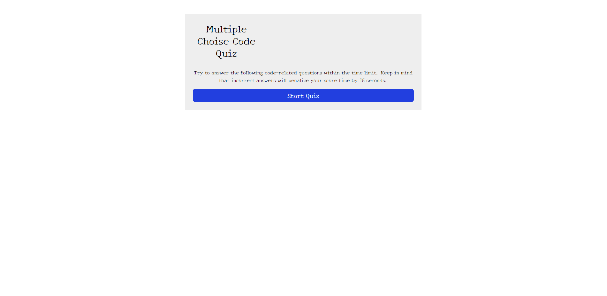

# 04 Web API's Code Quiz

UCSD-SD-FSF-PT-03-2021-U-C-MW

## Github repository and published webpage links below

[GitHub link](https://github.com/djony88/04_Web_APIs_Quiz)
[Published Webpage](https://djony88.github.io/04_Web_APIs_Quiz/)

Reqirement:

* Create a timed quiz with JavaScript that stores high scores.
* Create Click Start button that will star the quiz and 75 seconds timer.
* Presented questions will show up wit multiple choise answes.
* When answered a question, next one will present.
* If answered a question incorrectly time is subtracted from a clock by 15 seconds.
* When all questions are answered or timer reaches 0 game is over.
* When game is over new dialog is presented to input initals and after submitting you can see saved score.
* At saved score page there will be "Clear score" button that will clear all score from the page, and "Go back" button that will take you back to star page and you can restart quiz again.

HTML:

* Adding Google fonts
* Adding start game box
* Adding timer
* Adding quiz question sections
* Adding info about quiz on start up screen

* Add high score table after finishing quiz with Go back and Clear button

CSS:

* Adding body style and font family
* Adding game box style
* Adding start button style

JavaScript:

* Adding variables
* Adding multiple choise questions and answers
* Starting quiz button 
* Seting countown clock
* Adding reponse alert message
* End game function

* Adding score page variables
* Adding score functions
* Adding back button function
* Adding clear score button

